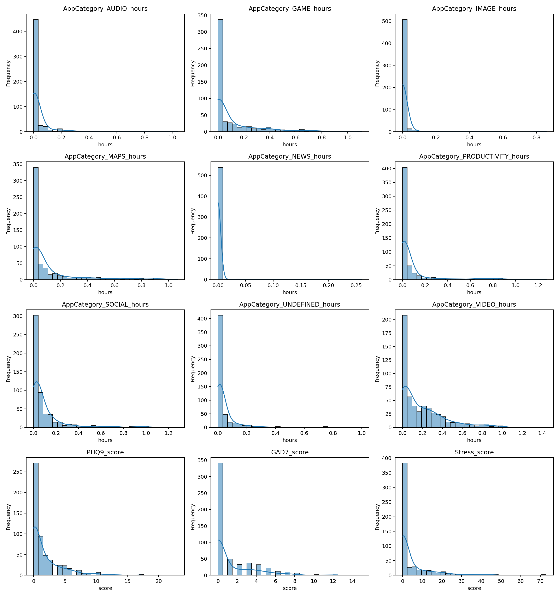
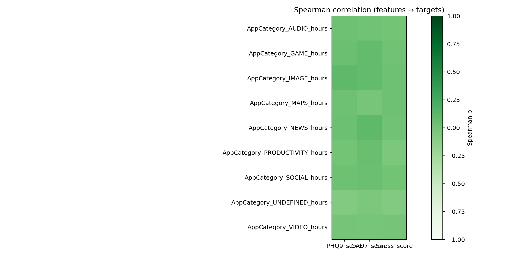
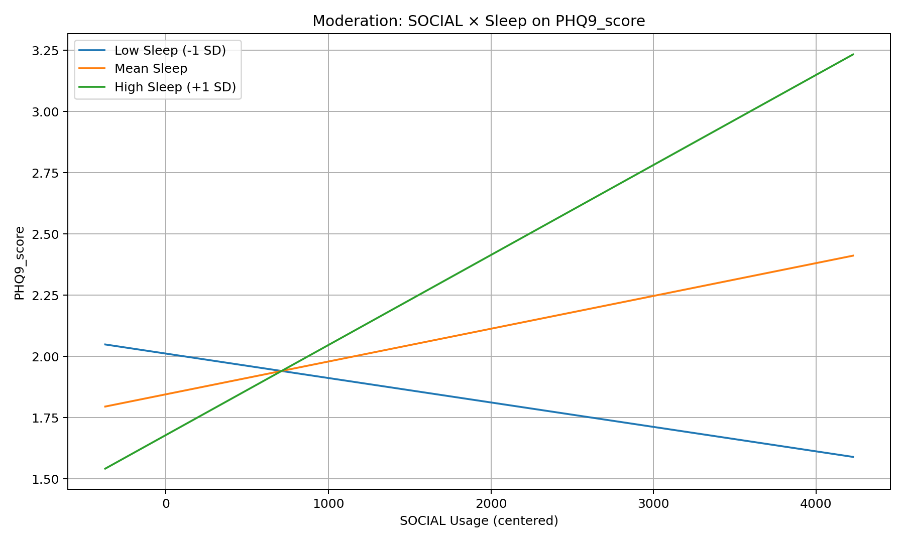
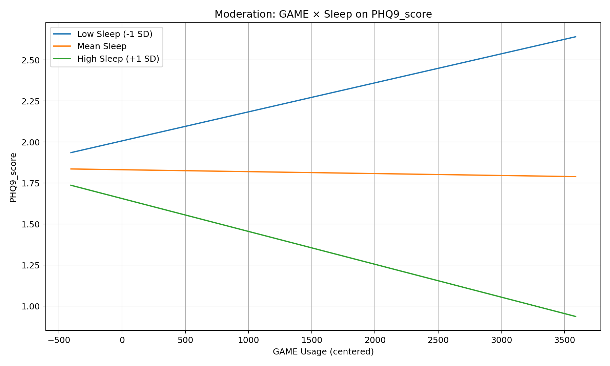

App Usage × Sleep ↔ Mental Health (Portfolio)

스마트폰 앱 사용량(카테고리별), 수면 신뢰도/중도각성, 정신건강 설문(PHQ-9, GAD-7, Stress) 를 결합해 관계를 분석했습니다.
대용량 전처리는 PySpark, 분석은 Spearman+FDR(다중비교 보정)과 조절 회귀(클러스터-강건 SE) 로 수행했습니다.
데이터는 비공개이며, 코드와 결과물(표/그림)만 공개합니다.

---

## Preview

   
 
   

자세한 표/요약 👉 docs/results_summary.md

---

## Key Findings

단순 상관(Spearman) + FDR 보정: 전 조합에서는 유의 상관 없음 (보수적 다중비교 & 제로-많음/긴 꼬리 분포의 영향).

조절효과(상호작용):

SOCIAL × 수면 신뢰도 → PHQ9/GAD7/Stress 일부에서 유의(p<.05)

GAME × 수면 신뢰도 → PHQ9/Stress에서 유의(p<.05)
→ 수면 상태에 따라 앱 사용량-정신건강의 기울기(영향) 가 달라지는 맥락 의존적 관계를 시사.

설명력: R²는 낮음(≈0.01~0.03). 추가 공변량/모형 개선 여지 큼.

Reporting policy: 이론에 근거한 가설 기반(소수쌍) FDR 결과를 “확증적”으로, 전 조합 결과(보정 전 Top 등)는 “탐색적”으로 분리 보고합니다.

---

## Repository Layout
.
├── all_data/                         # (비공개) 원천 CSV 넣는 위치
├── notebooks/
│   ├── 01_data_preprocessing.ipynb   # Spark 전처리/통합/저장
│   ├── 02_correlation_analysis.ipynb # 기술통계/히스토그램/Spearman+FDR
│   └── 03_regression_analysis.ipynb  # 단계적 회귀(조절효과), cluster-robust SE
│   └── results/
│       ├── figures/                  # dist_panels, heatmap, moderation plots
│       └── tables/                   # descriptive_stats, spearman_fdr, moderation_step3_APA, VIF, …
├── docs/
│   ├── methodology.md                # 데이터/설계/지표 설명
│   ├── limitations_ethicss.md        # 윤리/한계
│   └── results_summary.md            # 자동 생성된 결과 요약
├── scripts/
│   └── build_results_summary.py      # 결과 요약 MD 자동 생성 스크립트
├── requirements.txt                  # (참고) 의존성
└── LICENSE

---

## Methods (간단 요약)

01 전처리
설문 JSON 파싱→PHQ9/GAD7/Stress 점수 산출, 앱 사용 카테고리 피벗(초→시간 파생 _hours),
수면 mean_confidence 주평균, 중도각성 HH:MM:SS→분 변환,
week/uid 타입 정규화, 결측 평균 대치 → Parquet 저장.

02 상관/기술통계
기술통계(+중앙값)·히스토그램, Spearman 상관 + FDR(BH) 보정.
(옵션) 가설 기반 소수쌍 FDR / 탐색적 Top-5(보정 전) 별도 저장.

03 회귀(조절효과)
_hours 및 수면 지표 중심화, 앱×수면 상호작용, 단계적 회귀(Step1~3),
cluster-robust 표준오차(그룹=uid), VIF, 조절 플롯 저장.
(옵션) within-person(디미닝) 회귀/혼합모형으로 개인 내 변화도 검토 가능.

---

## How to Run (데이터 비공개 전제)

1. 데이터 위치

all_data/
├─ filtering_complete_app_usage.csv
├─ response_week_mapping_adjusted.csv
├─ sleep_week_mapped.csv
└─ sleep_diary_week_mapped.csv

2. 실행 순서

01_data_preprocessing.ipynb 실행 → notebooks/results/tables/processed_weekly/ 생성

02_correlation_analysis.ipynb 실행 → 표/그림 저장

03_regression_analysis.ipynb 실행 → 회귀 표/조절 플롯 저장

3. 요약 파일 생성

python scripts/build_results_summary.py

환경 권장: Python 3.11/3.12 + PySpark 3.5.x, pandas/pyarrow/statsmodels/scipy.
(PySpark 구버전/3.12 조합에서 distutils 이슈가 있으면 pip -U pyspark packaging setuptools.)

---

##  Key Artifacts

Figures:
notebooks/results/figures/dist_panels.png,
notebooks/results/figures/spearman_heatmap.png,
notebooks/results/figures/moderation_*.png

Tables:
notebooks/results/tables/descriptive_stats.csv,
notebooks/results/tables/spearman_fdr.csv,
notebooks/results/tables/moderation_step3_APA.csv,
notebooks/results/tables/vif_by_category.csv
(옵션) spearman_fdr_hypotheses.csv, spearman_exploratory_top.csv

---

## Ethics & Limitations (요약)

원본 데이터는 비공개(개인정보/민감정보 보호).

제로-많음·긴 꼬리 분포로 단순 상관은 둔감; 대신 조절효과/맥락 의존에 초점.

R² 낮음 → 추가 공변량/모형(로그변환/허들·혼합모형) 탐색 여지.

자세한 내용은 docs/limitations_ethicss.md
 참고.

---

## Next Steps (Roadmap)

log1p(hours)/윈저라이즈 등 강건성(robustness) 비교

Within-person/혼합모형으로 개인 내 변화만 분리 추정

앱 카테고리 도메인 리그룹(Social media vs Productivity 등)

추가 공변량(수면시간/요일 패턴/사용 맥락) 투입

---

## License

본 리포지터리는 LICENSE 파일을 따릅니다. 원본 데이터는 포함되어 있지 않습니다.