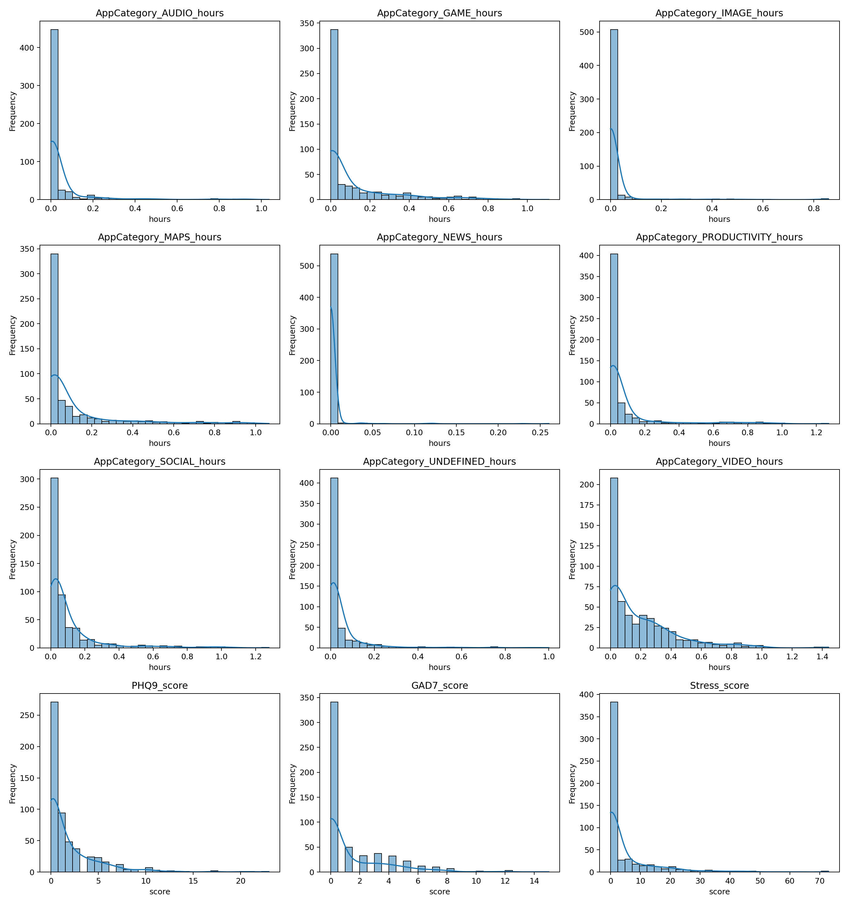

# Results Summary

*Results base:* `/home/biot/github/AppUsageMentalHealthAnalysis/notebooks/results`

## Key Descriptive Stats (top 10)

| column                         |   count |       mean |       std |         min |        25% |        50% |         75% |       max |     median |
|:-------------------------------|--------:|-----------:|----------:|------------:|-----------:|-----------:|------------:|----------:|-----------:|
| AppCategory_AUDIO_hours        |     552 | 0.0509994  | 0.145191  | 0           | 0          | 0.00361111 | 0.0192361   |  1.03611  | 0.00361111 |
| AppCategory_GAME_hours         |     552 | 0.11243    | 0.196567  | 0           | 0          | 0          | 0.144653    |  1.10889  | 0          |
| AppCategory_IMAGE_hours        |     552 | 0.020863   | 0.0967887 | 0           | 0          | 0          | 0.000277778 |  0.858333 | 0          |
| AppCategory_MAPS_hours         |     552 | 0.107635   | 0.200633  | 0           | 0.00583333 | 0.0183333  | 0.0975694   |  1.065    | 0.0183333  |
| AppCategory_NEWS_hours         |     552 | 0.00214271 | 0.0177023 | 0           | 0          | 0          | 0           |  0.260278 | 0          |
| AppCategory_PRODUCTIVITY_hours |     552 | 0.0805052  | 0.18943   | 0           | 0.00361111 | 0.0102778  | 0.0470139   |  1.27167  | 0.0102778  |
| AppCategory_SOCIAL_hours       |     552 | 0.103847   | 0.18428   | 0.000277778 | 0.011875   | 0.0366667  | 0.105625    |  1.27806  | 0.0366667  |
| AppCategory_UNDEFINED_hours    |     552 | 0.052967   | 0.129653  | 0.000277778 | 0.00305556 | 0.0113889  | 0.0340972   |  0.999722 | 0.0113889  |
| AppCategory_VIDEO_hours        |     552 | 0.194758   | 0.233125  | 0           | 0.0116667  | 0.109583   | 0.291181    |  1.44167  | 0.109583   |
| PHQ9_score                     |     552 | 1.83514    | 3.05782   | 0           | 0          | 1          | 3           | 23        | 1          |

## Top Correlations (FDR < 0.05)

_No significant correlations under FDR < 0.05._

## Significant Moderation Effects (Step3, p<.05)

| Category   | Dependent    |         R2 |   Inter_t |    Inter_p |
|:-----------|:-------------|-----------:|----------:|-----------:|
| SOCIAL     | GAD7_score   | 0.0083651  |   2.20607 | 0.0273788  |
| SOCIAL     | PHQ9_score   | 0.00575298 |   3.82559 | 0.00013046 |
| GAME       | PHQ9_score   | 0.0042018  |  -2.25497 | 0.024135   |
| SOCIAL     | Stress_score | 0.0137948  |   2.46849 | 0.0135683  |
| GAME       | Stress_score | 0.0148883  |  -2.32098 | 0.0202877  |

## Figures

## Hypotheses-Only Correlations (FDR, limited pairs)

| feature                        | target       |         rho |     p_raw |    p_fdr | sig_fdr   |
|:-------------------------------|:-------------|------------:|----------:|---------:|:----------|
| AppCategory_GAME_hours         | GAD7_score   |  0.079397   | 0.0623044 | 0.747653 | False     |
| AppCategory_PRODUCTIVITY_hours | GAD7_score   |  0.0513401  | 0.228481  | 0.83975  | False     |
| AppCategory_SOCIAL_hours       | GAD7_score   |  0.0432812  | 0.310082  | 0.83975  | False     |
| AppCategory_VIDEO_hours        | GAD7_score   | -0.0177624  | 0.67711   | 0.968923 | False     |
| AppCategory_GAME_hours         | PHQ9_score   |  0.0419445  | 0.325277  | 0.83975  | False     |
| AppCategory_PRODUCTIVITY_hours | PHQ9_score   | -0.00166196 | 0.968923  | 0.968923 | False     |
| AppCategory_SOCIAL_hours       | PHQ9_score   |  0.0267264  | 0.530911  | 0.968923 | False     |
| AppCategory_VIDEO_hours        | PHQ9_score   | -0.00954322 | 0.822982  | 0.968923 | False     |
| AppCategory_PRODUCTIVITY_hours | Stress_score | -0.0398619  | 0.349896  | 0.83975  | False     |
| AppCategory_GAME_hours         | Stress_score |  0.0150361  | 0.724473  | 0.968923 | False     |
| AppCategory_SOCIAL_hours       | Stress_score |  0.00272332 | 0.949099  | 0.968923 | False     |
| AppCategory_VIDEO_hours        | Stress_score | -0.0105305  | 0.805019  | 0.968923 | False     |

## Exploratory Top-5 by |rho| (uncorrected, descriptive)

| feature                        | target       |        rho |     p_raw |    p_fdr | sig_fdr   |   abs_rho |
|:-------------------------------|:-------------|-----------:|----------:|---------:|:----------|----------:|
| AppCategory_NEWS_hours         | GAD7_score   |  0.103579  | 0.0149091 | 0.201273 | False     | 0.103579  |
| AppCategory_GAME_hours         | GAD7_score   |  0.079397  | 0.0623044 | 0.292033 | False     | 0.079397  |
| AppCategory_IMAGE_hours        | GAD7_score   |  0.0789975 | 0.0636372 | 0.292033 | False     | 0.0789975 |
| AppCategory_PRODUCTIVITY_hours | GAD7_score   |  0.0513401 | 0.228481  | 0.841617 | False     | 0.0513401 |
| AppCategory_SOCIAL_hours       | GAD7_score   |  0.0432812 | 0.310082  | 0.841617 | False     | 0.0432812 |
| AppCategory_IMAGE_hours        | PHQ9_score   |  0.104247  | 0.0142708 | 0.201273 | False     | 0.104247  |
| AppCategory_UNDEFINED_hours    | PHQ9_score   | -0.0829791 | 0.051354  | 0.292033 | False     | 0.0829791 |
| AppCategory_GAME_hours         | PHQ9_score   |  0.0419445 | 0.325277  | 0.841617 | False     | 0.0419445 |
| AppCategory_NEWS_hours         | PHQ9_score   |  0.0379068 | 0.374052  | 0.841617 | False     | 0.0379068 |
| AppCategory_AUDIO_hours        | PHQ9_score   |  0.0300311 | 0.481352  | 0.883746 | False     | 0.0300311 |
| AppCategory_UNDEFINED_hours    | Stress_score | -0.0786264 | 0.0648961 | 0.292033 | False     | 0.0786264 |
| AppCategory_PRODUCTIVITY_hours | Stress_score | -0.0398619 | 0.349896  | 0.841617 | False     | 0.0398619 |
| AppCategory_IMAGE_hours        | Stress_score |  0.0266637 | 0.531874  | 0.883746 | False     | 0.0266637 |
| AppCategory_MAPS_hours         | Stress_score |  0.0252835 | 0.553331  | 0.883746 | False     | 0.0252835 |
| AppCategory_GAME_hours         | Stress_score |  0.0150361 | 0.724473  | 0.924109 | False     | 0.0150361 |